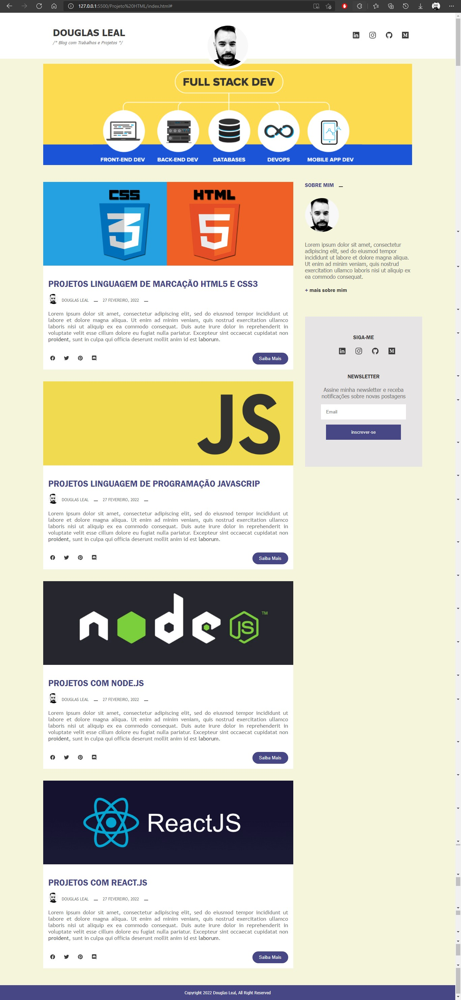

# Projeto Blog Pessoal

Criação de um template para blog com HTML5 e CSS3  

No projeto foi utilizado os conceitos de semântica do HTML5, utilizando tags com HEADER, SECTION, ARTICLE e FOOTER. Para alinhamento e gerenciamento de espaços foi utilizado conceitos de flexbox, como orientação por eixos (linhas e colunas).

Em CSS foi utilizado além dos conceitos fundamentais, efeitos (animações) em imagens utilizando TRANSITION e TRANSFORM para efeito de zoom nas imagens das postagens. 

 #

Demonstração [Site Projeto](https://douleal.github.io/BlogTemplates/)

 #

